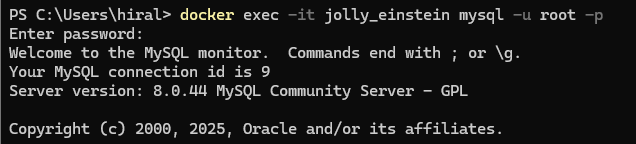
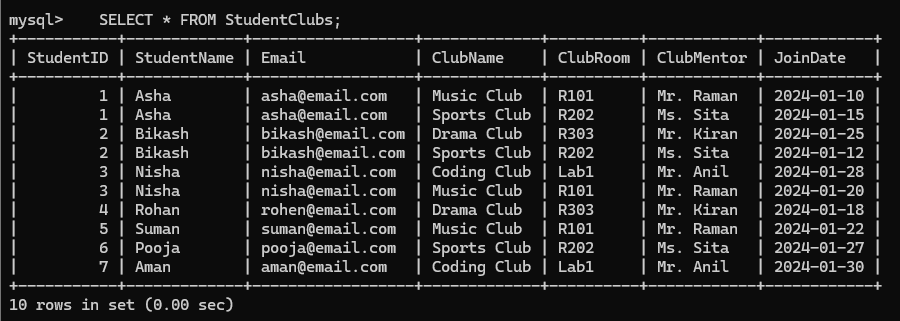
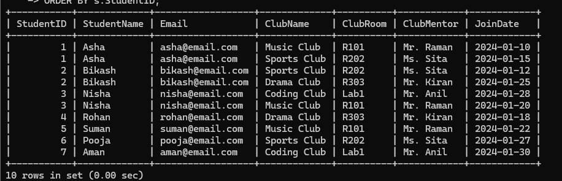

In docker to create mysql server we first have to full sql image and run that image. I have pulled the image by command: docker pull mysql:8.0

After pulling and running image we have to execute the image in docker. This helps in creating mysql server in docker.

By converting table in 1NF it helps in removing the repeating group of information in an entry. If any data is repeated again in same table, these datas are  kept in separate table or row.

To be in 3NF(Third Normal From) the table should be first in 2NF. In 3NF non key column doesnot depend on other non key columns. In the above tables there is still transitive dependency. So to get 3NF we should clear those dependencies. 

