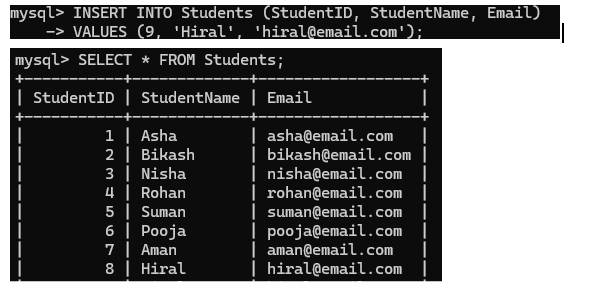
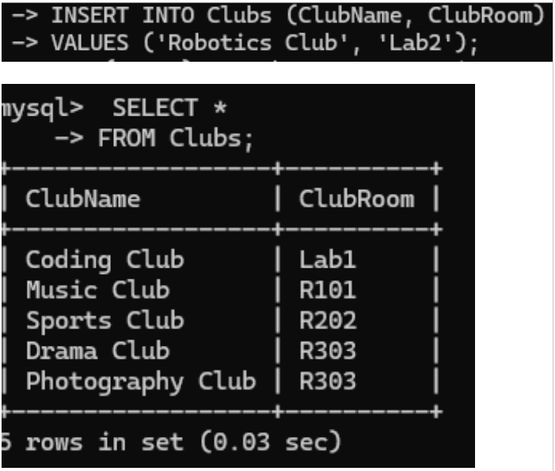
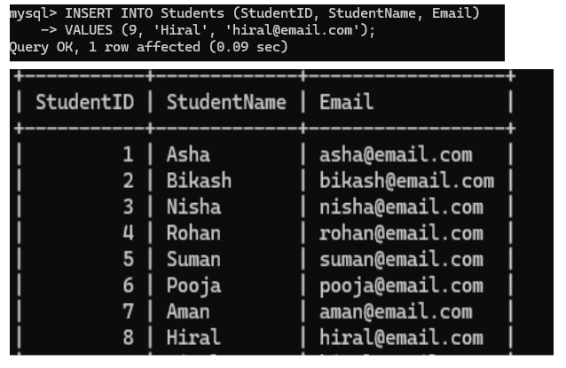
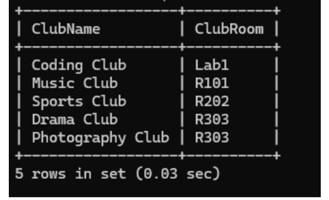
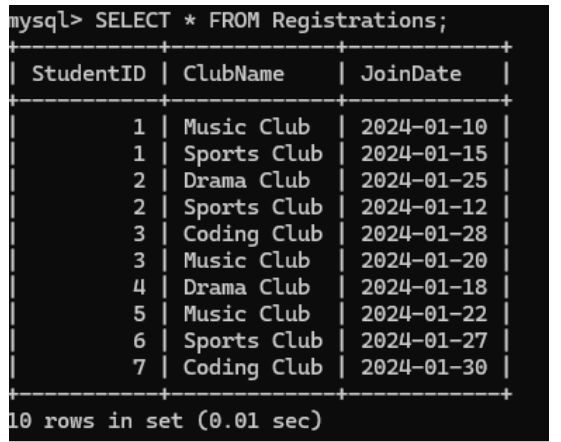
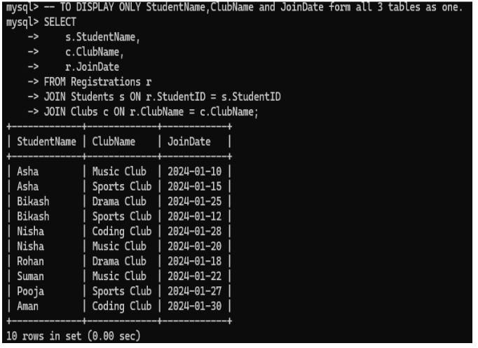

Now we will insert a new studentID= 8 , StudentName=Hiral and email=hiral@gmail.com. To do this we will use command:

Now we wiil insert a new clubname and clubroom in the clubs table. We will add new club that is photography club .

In the above fig we used command SETECT*FROM clubs: to display this updated table

Now we will display all tables which consist of Studentname , Clubname and registration. For this we will use:

Fig: club table 

Fig: registration table 

Extracting Studentname, clubname adn joindate and showing them in one place
